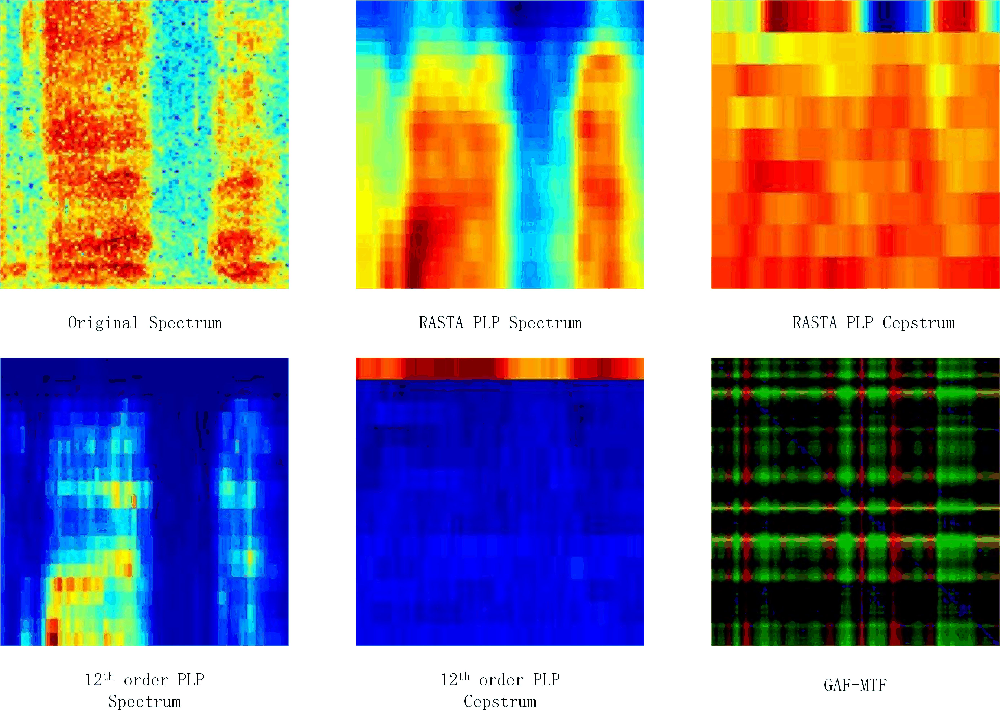

# time-series-classification
short and long time series classification using convolutional neural networks

In this project, we present a novel framework for time series classification, which is based on 
Gramian Angular Summation/Difference Fields and Markov Transition Fields (GAF-MTF), a recently published 
image feature extraction method. A convolutional neural network (CNN) was employed as the classifier. 
This framework enables the use of CNN to learn high-level features and classify time series. 
Its performance was evaluated on 16 standard datasets. Experiment results show that our framework outperforms 
or achieves the same level at least with the GAF-MTF+Tiled CNN framework on 14 of the 16 datasets. 
And it obtained competitive performance compared with other 8 representive approaches. 
Furthermore, we compared the performance of GAF-MTF feature with other 5 image features on a large-scale cough dataset. 
Results indicates that the GAF-MTF feature is not suitable for large-scale cough datasets 
while its competitive performance on the standard datasets.

## Extracting image features
### Short time series
Image features for short time series:

- GASF

 
- GADF

 
- MTF

 

### Large-scale cough dataset
Image features for cough dataset:

- Comparision of the six image features:

  

## CNN
- Framework for short time series classification:

 
- AlexNet/CaffeNet

 

## Results
- short time series classification:

 
- long time series classificaiton:

 

## Appendix
Dataset information:
- Short: [UCR Time Series Classification Archive](http://www.cs.ucr.edu/~eamonn/time_series_data/)
- Long: [Cough dataset from Tongji Hospital](http://bmcmedinformdecismak.biomedcentral.com/articles/10.1186/1472-6947-15-S4-S2)
 
Software Links:
- [Caffe: deep learning framework](http://caffe.berkeleyvision.org/)
- [RASTAMAT](http://labrosa.ee.columbia.edu/matlab/rastamat/)

